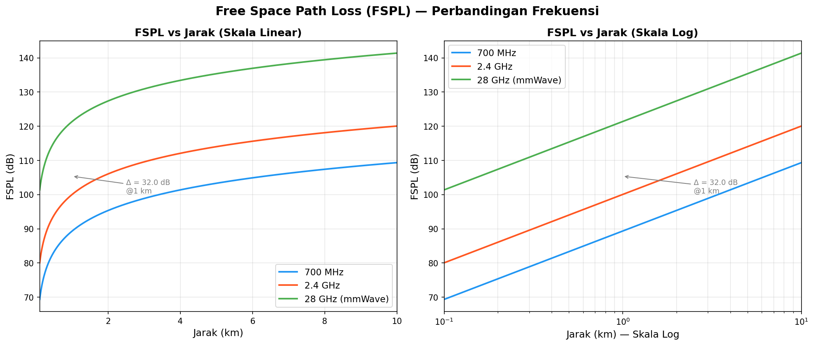
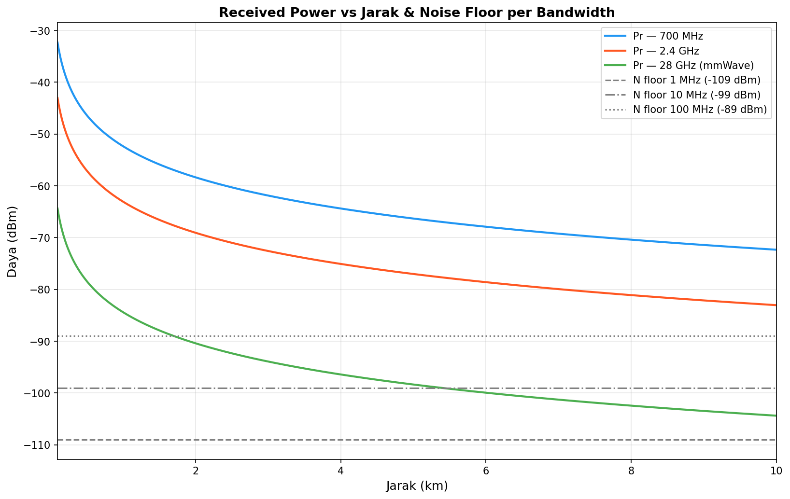
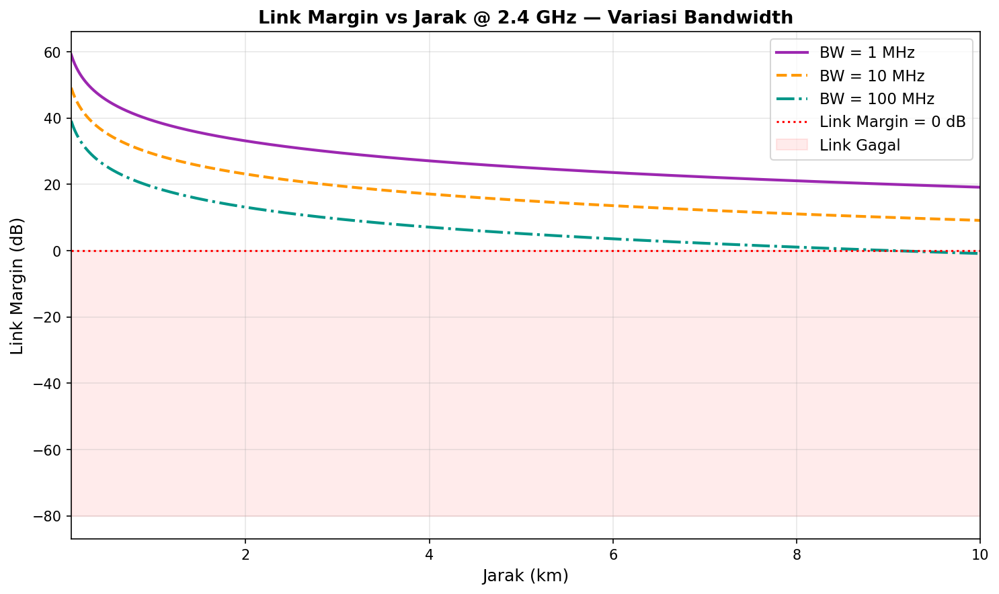
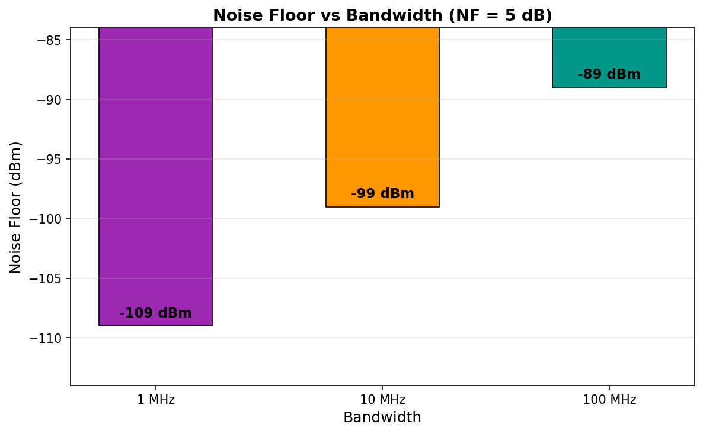
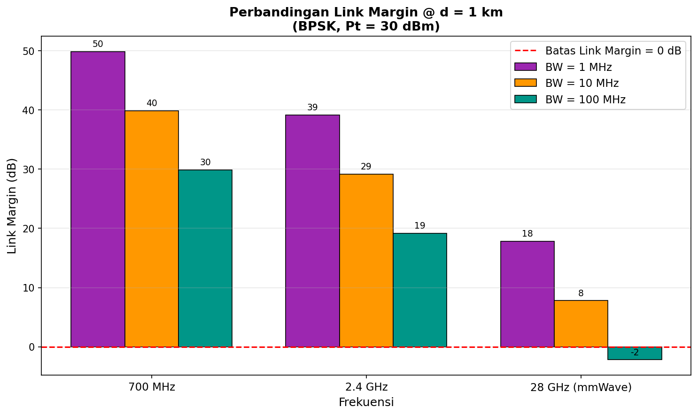
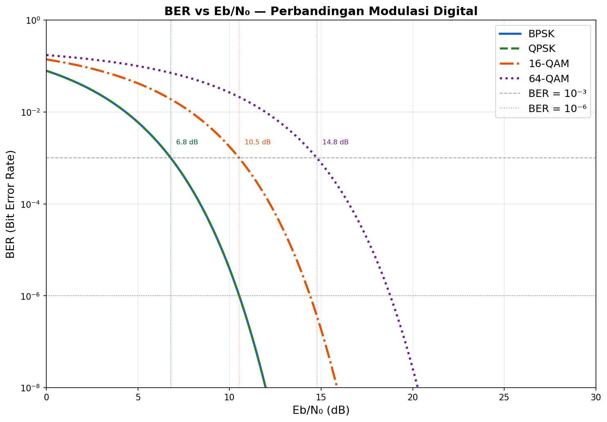
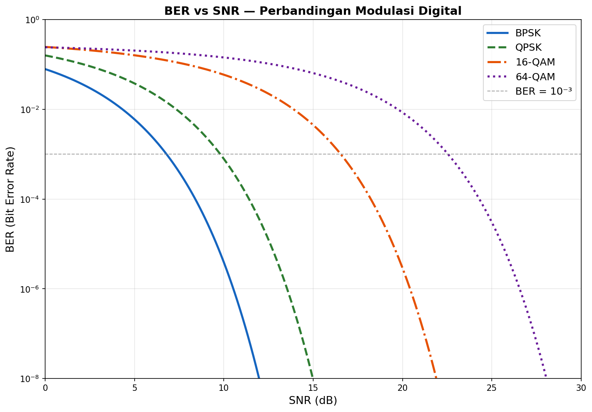
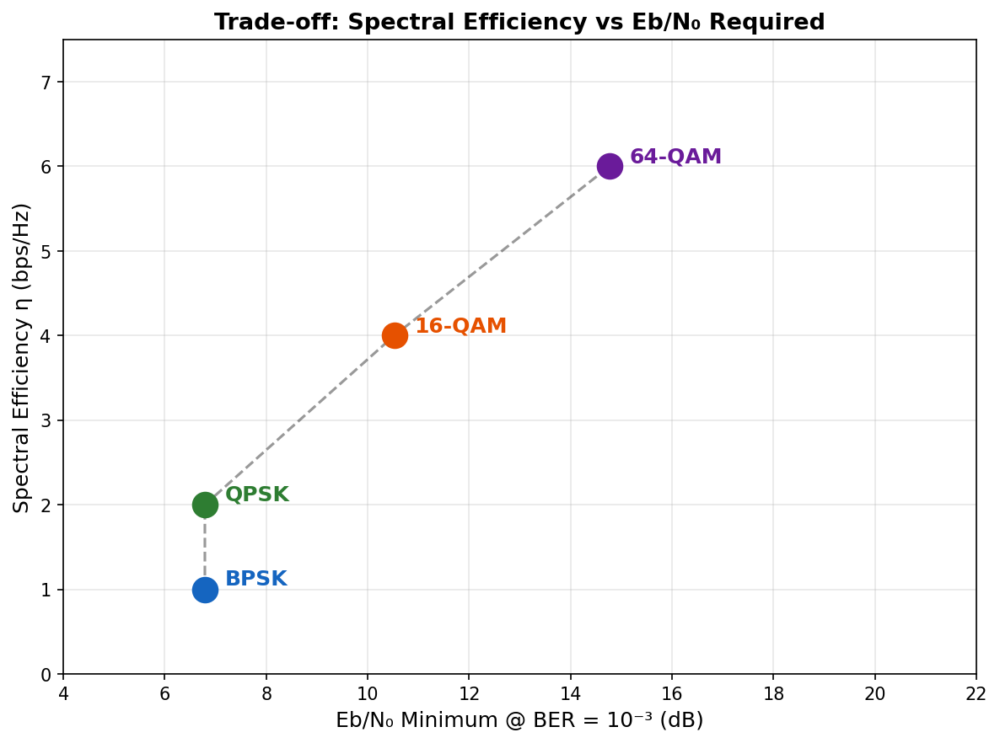
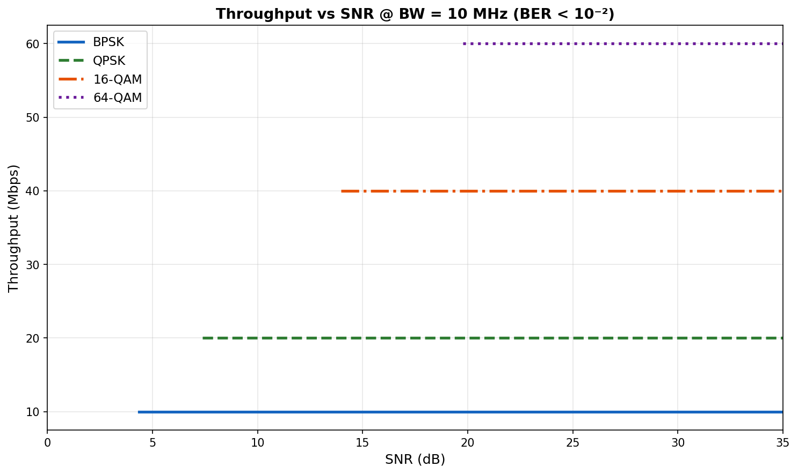

# Simulasi Link Budget dan Trade-off Modulasi pada Sistem Komunikasi Nirkabel

> **Kelompok C — Sistem Komunikasi Nirkabel**
>
> | No | Nama | NPM |
> |:--:|------|-----|
> | 1 | Muhammad Jibril Adrian | 2206059660 |
> | 2 | Falah Andhesryo | 2306161990 |
> | 3 | Muhammad Riyan Satrio Wibowo | 2306229323 |
> | 4 | Ryan Adidaru Excel Barnabi | 2306266994 |

Simulasi sistem komunikasi nirkabel untuk pengiriman video monitoring dari drone ke ground station. Mencakup analisis FSPL, link budget, BER vs Eb/N₀, dan rekomendasi desain untuk tiga skenario lingkungan.

---

## Struktur Proyek

```
MiniProject_Wireless/
├── src/
│   ├── fspl.py          # Bagian 1: FSPL simulation
│   ├── link_budget.py   # Bagian 2: Link budget analysis
│   ├── modulation.py    # Bagian 3: BER vs Eb/N0 analysis
│   └── main.py          # Runner: generates all plots + tables
├── report/
│   └── laporan.ipynb    # Laporan lengkap (Jupyter Notebook)
├── plots/               # Output grafik (auto-generated)
└── README.md
```

---

## Cara Menjalankan

```bash
pip install numpy matplotlib scipy jupyter

# Generate semua plot + output tabel
python3 src/main.py

# Buka laporan Jupyter
jupyter notebook report/laporan.ipynb
```

**Google Colab:** Upload folder `src/` lalu ubah path import di notebook:
```python
import sys; sys.path.insert(0, '/content/src')
```

---

## Parameter Sistem

| Parameter | Nilai |
|-----------|-------|
| Pt (Tx Power) | 30 dBm |
| Gt / Gr | 5 dBi |
| Lmisc | 3 dB |
| Noise Figure (NF) | 5 dB |
| Frekuensi | 700 MHz, 2.4 GHz, 28 GHz |
| Bandwidth | 1 MHz, 10 MHz, 100 MHz |
| Modulasi | BPSK, QPSK, 16-QAM, 64-QAM |
| Target BER | 10⁻³ |
| Jarak simulasi | 100 m – 10 km |

---

## Hasil Simulasi

### Bagian 1 — Free Space Path Loss (FSPL)



**Tabel FSPL (dB) per frekuensi dan jarak:**

| Jarak | 700 MHz | 2.4 GHz | 28 GHz (mmWave) |
|------:|--------:|--------:|----------------:|
| 0.1 km | 69.34 | 80.04 | 101.38 |
| 0.5 km | 83.32 | 94.02 | 115.36 |
| 1.0 km | 89.34 | 100.04 | 121.38 |
| 2.0 km | 95.36 | 106.06 | 127.40 |
| 5.0 km | 103.32 | 114.02 | 135.36 |
| 10.0 km | 109.34 | 120.04 | 141.38 |

**Temuan:** Perbedaan FSPL antara 700 MHz dan 28 GHz pada jarak yang sama selalu **32 dB** (karena $20\log_{10}(28000/700) = 32$ dB). Pada 10 km, 28 GHz sudah mencapai 141 dB — nyaris tidak mungkin diterima tanpa antena terarah beresolusi tinggi.

---

### Bagian 2 — Link Budget





**Tabel Link Budget @ d = 1 km (BPSK, Pt = 30 dBm):**

| Frekuensi | Pr (dBm) | N @ 1 MHz | LM @ 1 MHz | N @ 10 MHz | LM @ 10 MHz | N @ 100 MHz | LM @ 100 MHz |
|-----------|----------:|----------:|-----------:|-----------:|------------:|------------:|-------------:|
| 700 MHz   | −52.34 | −109.00 | **+49.86 dB** | −99.00 | **+39.86 dB** | −89.00 | **+29.86 dB** |
| 2.4 GHz   | −63.04 | −109.00 | **+39.16 dB** | −99.00 | **+29.16 dB** | −89.00 | **+19.16 dB** |
| 28 GHz    | −84.38 | −109.00 | **+17.82 dB** | −99.00 | **+7.82 dB** | −89.00 | **−2.18 dB** ❌ |

> ❌ Link margin negatif: link tidak dapat beroperasi tanpa antena terarah / penguatan tambahan.





**Noise floor per bandwidth (NF = 5 dB):**

| Bandwidth | Noise Floor | Selisih vs 1 MHz |
|-----------|------------:|------------------:|
| 1 MHz  | −109.0 dBm | — |
| 10 MHz | −99.0 dBm  | +10 dB |
| 100 MHz | −89.0 dBm | +20 dB |

**Temuan:** Setiap kenaikan bandwidth 10× menaikkan noise floor tepat 10 dB. Pada 28 GHz + 100 MHz, link margin di 1 km sudah negatif (−2.18 dB) — mmWave di area terbuka tanpa beamforming tidak layak.

---

### Bagian 3 — BER vs Eb/N₀ dan Trade-off Modulasi





**Tabel trade-off modulasi (target BER = 10⁻³):**

| Modulasi | η (bps/Hz) | Eb/N₀ min | SNR min | Throughput @ 10 MHz |
|----------|:----------:|----------:|--------:|--------------------:|
| BPSK     | 1 | 6.79 dB | 6.79 dB | 10 Mbps |
| QPSK     | 2 | 6.79 dB | 9.80 dB | 20 Mbps |
| 16-QAM   | 4 | 10.52 dB | 16.54 dB | 40 Mbps |
| 64-QAM   | 6 | 14.77 dB | 22.55 dB | 60 Mbps |





**Temuan:**
- BPSK dan QPSK memiliki **Eb/N₀ yang sama** (6.79 dB) — QPSK cukup 3 dB SNR tambahan untuk throughput 2×.
- 64-QAM butuh SNR **15.76 dB lebih tinggi** dari BPSK untuk BER yang sama, namun memberikan throughput 6×.
- Di bawah SNR 10 dB, 64-QAM memiliki BER > 10% — throughput efektif mendekati nol.

---

## Rekomendasi Desain

| Skenario | Frekuensi | Modulasi | Bandwidth | Alasan |
|----------|-----------|----------|-----------|--------|
| **A — Pedesaan** | 700 MHz | BPSK / QPSK | 1 MHz | Coverage luas, LM > 35 dB di 5 km, noise floor minimal |
| **B — Perkotaan** | 2.4 GHz | 16-QAM / 64-QAM | 10–100 MHz | Jarak dekat → SNR tinggi, throughput maksimal |
| **C — Drone Pegunungan** | 700 MHz | BPSK | 1 MHz | Fading berat → butuh modulasi paling robust, LM maksimal |
